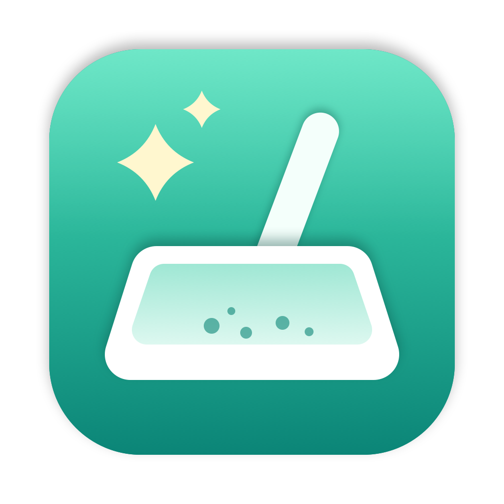
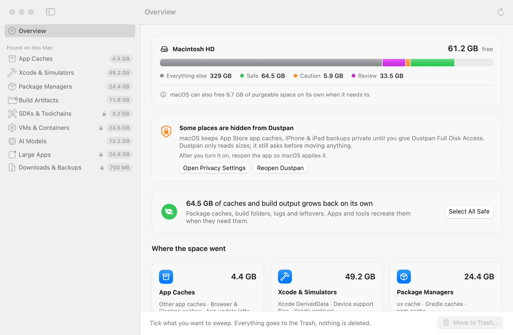
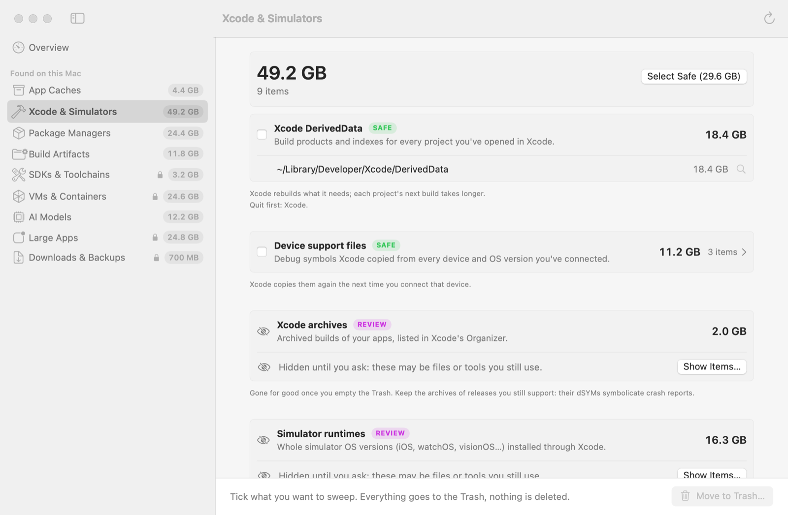
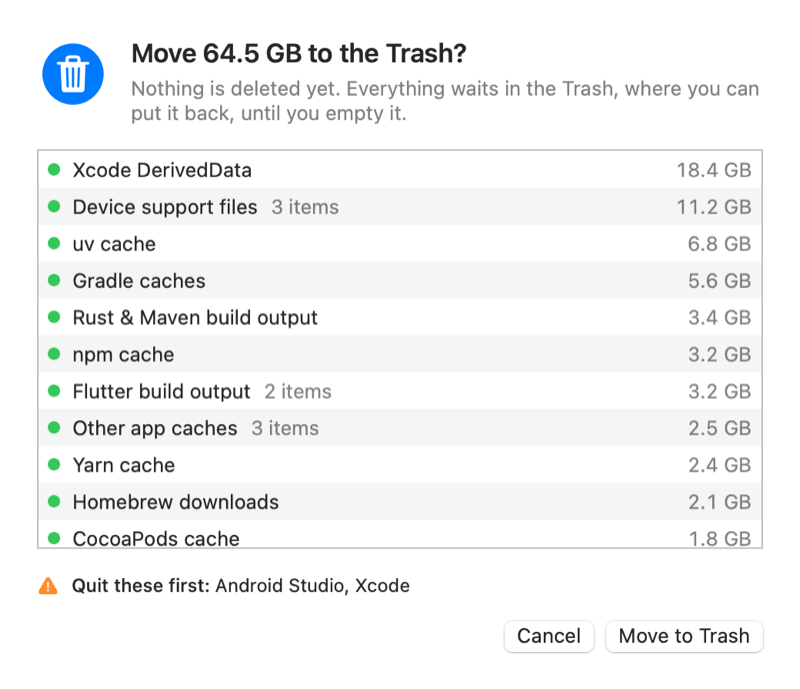
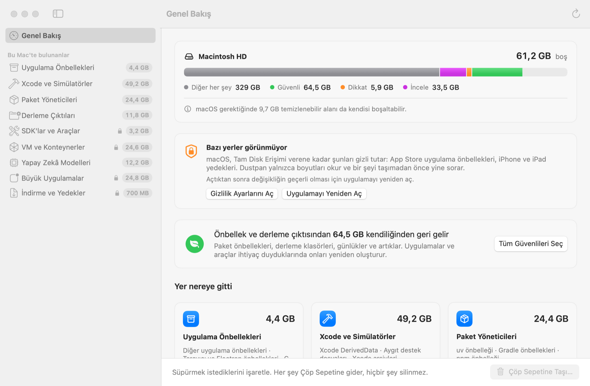

<p align="center">
  
</p>

<h1 align="center">Dustpan</h1>

<p align="center">
  See what's filling your Mac, then sweep it into the Trash.<br>
  A native macOS app and command-line tool. Free and open source.
</p>

<p align="center">
  <a href="https://github.com/arypak/dustpan/actions/workflows/ci.yml"></a>
</p>

<p align="center">
  <picture>
    <source media="(prefers-color-scheme: dark)" srcset="docs/screenshots/overview-dark.png">
    
  </picture>
</p>

## Why

Developer Macs fill up with things that grow back on their own: package caches, Xcode DerivedData,
simulator runtimes, `node_modules`, Flutter and Gradle build folders, Docker disks, downloaded AI models.
None of it shows up clearly in System Settings, and cleaning it by hand means remembering dozens of paths
and which of them are safe to throw away.

Dustpan knows those paths. It measures them, explains what each one is and what happens once it's gone,
and moves the ones you pick to the Trash.

- **Nothing is deleted.** Dustpan only moves things to the Trash. You can put anything back until you empty it.
- **Every item explains itself.** What it is, what happens after it's gone, and which apps to quit first.
- **Risky items stay hidden until you ask.** Anything marked *Review* (apps, VMs, backups, virtual environments)
  opens only after you confirm, and nothing moves to the Trash without a second confirmation. The command line
  asks about each of them on its own and never moves them in bulk.
- **Three safety levels.** *Safe* regenerates on its own. *Caution* comes back after a re-download or rebuild.
  *Review* is your data, or a tool you may still use.
- **Leaves some jobs to the right tool.** Docker disks, simulator runtimes and Conda packages are best cleaned
  by their own commands, so Dustpan shows you the exact command instead of touching them.
- **A guard on every move.** Right before anything moves, a last check refuses the system, anything outside
  your home folder except apps, folders such as Documents, synced folders such as iCloud Drive, credential
  folders such as `~/.ssh` and `~/.aws`, and any folder with a Git repository inside.
- **Knows what's open.** If a cache you picked belongs to an app that's running, Dustpan tells you to quit it first.
- **Fast and quiet.** A full scan of a busy developer Mac takes a few seconds. No network, no telemetry,
  no background agent. It only reads until you ask it to move something.
- **Speaks English and Turkish, light or dark.** It follows your system by default; change either in Settings.

<p align="center">
  
  
</p>

## Install

Dustpan needs macOS 14 or later, on Apple silicon or Intel.

### Download

Get `Dustpan-<version>.zip` from the [latest release](https://github.com/arypak/dustpan/releases/latest), unzip it and
drag Dustpan to Applications. Dustpan isn't signed with an Apple Developer ID yet, so macOS blocks it the first
time you open it:

1. Open Dustpan. When macOS says it can't check it for malicious software, click **Done**.
2. Open **System Settings → Privacy & Security**, scroll to the note about Dustpan and click **Open Anyway**.

Or clear the download flag from Terminal instead:

```bash
xattr -dr com.apple.quarantine /Applications/Dustpan.app
```

The command-line tool is `dustpan-<version>-macos.tar.gz` on the same page. Unpack it, clear the flag, and move it
somewhere on your `PATH`:

```bash
tar -xzf dustpan-*-macos.tar.gz
```

```bash
xattr -d com.apple.quarantine dustpan
```

```bash
sudo mv dustpan /usr/local/bin/
```

Each release lists SHA-256 checksums in `SHA256SUMS`.

### Build from source

With Xcode 16 or later (Swift 6):

```bash
git clone https://github.com/arypak/dustpan.git
```

```bash
cd dustpan && make app
```

That puts `Dustpan.app` and the `dustpan` command in `build/`. To copy the app to `/Applications` and the
command to `/usr/local/bin`:

```bash
make install
```

## Command line

`dustpan` runs the same scan as the app and prints a report:

```text
$ dustpan

 Macintosh HD  ████████████████████████████░░░░  433 GB used of 494 GB · 61.2 GB free (+9.7 GB purgeable)

 SAFE  regenerates on its own                                       64.5 GB
   xcode-derived-data     Xcode DerivedData                         18.4 GB
   xcode-device-support   Device support files (3)                  11.2 GB
   uv-cache               uv cache                                   6.8 GB
   gradle-cache           Gradle caches                              5.6 GB
   …

 CAUTION  comes back after a re-download or rebuild                  5.9 GB
   node-modules           node_modules (3)                           1.7 GB
   …

 REVIEW  your data or tools you may still use                       33.5 GB
   large-apps             Large apps (4)                            24.8 GB
     Items stay hidden until you ask: dustpan scan --all
   …

 CLEAN IT YOURSELF  the tool that owns it should do the deleting
   docker-desktop         Docker Desktop disk                       24.6 GB
     run: docker system prune -a
   …

 70.4 GB of caches and build output comes back on its own (64.5 GB safe · 5.9 GB caution).
 33.5 GB more is yours to review, and 51.3 GB is best cleaned by its own tool.
 Looked for build folders in ~/Desktop, ~/Documents, ~/Code. Scanned in 4.2 s.

 dustpan clean --safe                                    move the 64.5 GB marked SAFE to the Trash
 dustpan clean xcode-derived-data xcode-device-support   or pick by id
 Nothing is deleted: items go to the Trash, and you empty it when you're sure.
```

| Command | What it does |
| --- | --- |
| `dustpan` | Scan and show what's taking space |
| `dustpan scan --all` | Also list every item inside each finding, including the ones marked *Review* |
| `dustpan scan --json` | Machine-readable report, sizes in bytes |
| `dustpan clean --safe --dry-run` | Show what everything marked *Safe* would move, move nothing |
| `dustpan clean --safe` | Move everything marked *Safe* to the Trash, after asking |
| `dustpan clean uv-cache node-modules --older-than 60` | Pick rules by id, optionally only items untouched for 60 days |
| `dustpan clean large-apps` | Rules marked *Review* ask about each item separately, even with `--yes` |
| `dustpan rules` | List every rule Dustpan knows |
| `dustpan --lang tr` | Any command in Turkish (the default is your system language) |

Build folders such as `node_modules` are searched for in `~/Desktop`, `~/Documents`, `~/Developer`, `~/Code` and
similar folders. Point it elsewhere with `--roots ~/work,~/oss`, or in the app's Settings.

## What it finds

A folder inside a project only counts when the file that proves what it is sits next to it: `node_modules` needs a
`package.json`, Flutter's `build/` needs a `pubspec.yaml`, `target/` needs a `Cargo.toml` or `pom.xml`. A hand-made
`build` folder is never touched.

| Rule | What it finds | Safety | Cleanup |
| --- | --- | --- | --- |
| **App Caches** | | | |
| `app-update-leftovers` | Installers that apps' built-in updaters downloaded and never cleaned up. | Safe | Trash |
| `browser-caches` | Web caches kept by Chromium browsers and Electron apps such as Slack, Discord, VS Code and Claude. | Safe | Trash |
| `editor-caches` | Compiled code and downloaded extension packages cached by VS Code and its forks (Cursor, Windsurf…). | Safe | Trash |
| `sandboxed-app-caches` | Caches of sandboxed apps (most App Store apps) inside ~/Library/Containers. | Safe | Trash |
| `logs` | Log files and crash reports apps have written. | Safe | Trash |
| `app-caches` | Everything else apps keep in ~/Library/Caches: thumbnails, downloads, compiled code. | Safe | Trash |
| **Xcode & Simulators** | | | |
| `xcode-derived-data` | Build products and indexes for every project you've opened in Xcode. | Safe | Trash |
| `xcode-device-support` | Debug symbols Xcode copied from every device and OS version you've connected. | Safe | Trash |
| `xcode-previews` | Simulator devices Xcode creates to render SwiftUI previews. | Safe | Trash |
| `xcode-caches` | Xcode's own caches, playground devices and test devices. | Safe | Trash |
| `simulator-caches` | Shared caches the Simulator builds for each runtime. | Safe | Trash |
| `simulator-unavailable` | Simulators whose OS version is no longer installed. They can't boot anymore. | Safe | `xcrun simctl delete unavailable` |
| `simulator-data` | Apps and data installed inside your simulators. | Caution | `xcrun simctl shutdown all && xcrun simctl erase all` |
| `simulator-runtimes` | Whole simulator OS versions (iOS, watchOS, visionOS…) installed through Xcode. | Review | `xcrun simctl runtime delete <identifier>` |
| `xcode-archives` | Archived builds of your apps, listed in Xcode's Organizer. | Review | Trash |
| **Package Managers** | | | |
| `homebrew-cache` | Bottles and source archives Homebrew downloaded while installing. | Safe | Trash |
| `npm-cache` | Every package npm has downloaded. | Safe | Trash |
| `yarn-cache` | Packages downloaded by Yarn. | Safe | Trash |
| `pnpm-store` | pnpm's global package store and metadata cache. | Caution | Trash |
| `bun-cache` | Packages downloaded by Bun. | Safe | Trash |
| `pip-cache` | Wheels and downloads cached by pip. | Safe | Trash |
| `uv-cache` | Python packages downloaded and built by uv. | Safe | Trash |
| `poetry-cache` | Packages and metadata cached by Poetry. | Safe | Trash |
| `conda-packages` | Package archives and extracted packages kept by Conda. | Safe | `conda clean --all` |
| `pyinstaller-cache` | Binaries PyInstaller already processed for earlier builds. | Safe | Trash |
| `gradle-cache` | Dependencies and build caches downloaded by Gradle (Android, Kotlin, Java). | Safe | Trash |
| `gradle-wrappers` | Gradle versions downloaded by your projects' Gradle wrappers. | Caution | Trash |
| `maven-repository` | Every Java dependency Maven has downloaded. | Caution | Trash |
| `cocoapods-cache` | Pods CocoaPods downloaded for your projects. | Safe | Trash |
| `dart-pub-cache` | Packages downloaded by flutter pub get and dart pub get. | Caution | Trash |
| `go-build-cache` | Compiled Go packages. | Safe | Trash |
| `go-module-cache` | Go modules downloaded for your projects. | Caution | `go clean -modcache` |
| `cargo-cache` | Crates and git checkouts downloaded by Cargo. | Safe | Trash |
| `nuget-packages` | NuGet packages downloaded for .NET projects. | Caution | Trash |
| `composer-cache` | PHP packages cached by Composer. | Safe | Trash |
| `deno-cache` | Modules downloaded and compiled by Deno. | Safe | Trash |
| `node-gyp-cache` | Node.js headers downloaded to compile native modules. | Safe | Trash |
| `electron-downloads` | Electron binaries downloaded by electron and electron-builder. | Safe | Trash |
| `test-browsers` | Browsers downloaded by Playwright and Puppeteer for automated testing. | Caution | Trash |
| `jetbrains-caches` | Indexes and caches of JetBrains IDEs and Android Studio. | Safe | Trash |
| **Build Artifacts** | | | |
| `node-modules` | Installed JavaScript dependencies inside your projects. | Caution | Trash |
| `js-build-caches` | Build output and caches of Next.js, Nuxt, SvelteKit, Turborepo, Parcel and Angular. | Safe | Trash |
| `flutter-build` | What flutter clean removes: build/ and .dart_tool/ in Flutter and Dart projects. | Safe | Trash |
| `gradle-build` | build/ and .gradle/ folders in Android, Kotlin and Java projects. | Safe | Trash |
| `target-folders` | target/ folders in Cargo and Maven projects. | Safe | Trash |
| `swiftpm-build` | .build/ folders in Swift packages. | Safe | Trash |
| `cocoapods-pods` | Pods/ folders installed by CocoaPods in iOS projects. | Caution | Trash |
| `python-venvs` | Virtual environments inside your projects. | Review | Trash |
| **SDKs & Toolchains** | | | |
| `arduino-staging` | Archives the Arduino IDE downloaded and already installed. | Safe | Trash |
| `platformio-cache` | Downloads cached by PlatformIO. | Safe | Trash |
| `android-system-images` | Emulator system images, one folder per Android version. | Review | Trash |
| `android-emulators` | Virtual devices you created in Android Studio, with their disks and snapshots. | Review | Android Studio → Device Manager → ⋮ → Delete |
| `android-ndk` | Native Development Kit versions, often several side by side. | Review | Trash |
| `arduino-packages` | Board support and compiler toolchains installed by the Arduino IDE. ESP32 alone takes about 5 GB. | Review | Trash |
| **VMs & Containers** | | | |
| `docker-desktop` | Docker Desktop's virtual disk: your images, containers, volumes and build cache. | Review | `docker system prune -a` |
| `colima` | The Linux VM Colima runs Docker in, with all your images and containers. | Review | `docker system prune -a` |
| `orbstack` | OrbStack's disk with your containers, images and Linux machines. | Review | `docker system prune -a` |
| `claude-vm` | The Linux VM the Claude desktop app uses for its agent features. | Review | Trash |
| `crossover-bottles` | Windows apps installed with CrossOver, one bottle each. | Review | Trash |
| `parallels-vms` | Virtual machines stored in ~/Parallels. | Review | Trash |
| `utm-vms` | Virtual machines created in UTM. | Review | Trash |
| `vagrant-boxes` | Base box images downloaded by Vagrant. | Caution | Trash |
| **AI Models** | | | |
| `huggingface-cache` | Models and datasets downloaded by transformers, diffusers and other Hugging Face libraries. | Caution | Trash |
| `ollama-models` | Local language models downloaded with Ollama. | Review | `ollama list   # then: ollama rm <model>` |
| `lmstudio-models` | Models downloaded in LM Studio, grouped by publisher. | Review | Trash |
| **Large Apps** | | | |
| `large-apps` | Apps over 500 MB in your Applications folders, with when you last opened each. | Review | Trash |
| **Downloads & Backups** | | | |
| `device-updates` | iOS and iPadOS firmware Finder downloaded to update or restore devices. | Safe | Trash |
| `mail-downloads` | Copies of attachments you opened from Mail. The originals stay in your mailboxes. | Safe | Trash |
| `old-installers` | Disk images and installer packages in Downloads that are more than a week old. | Review | Trash |
| `device-backups` | Local device backups made by Finder. | Review | Trash |
| `messages-attachments` | Photos, videos and files from your conversations in Messages. | Review | System Settings → General → Storage → Messages |

The table comes from `dustpan rules --markdown`.

## Languages

Dustpan speaks English and Türkçe. The app and the `dustpan` command follow your system language; switch in
**Settings → General** or with `--lang en` / `--lang tr`. Sizes and dates follow the language too, so Turkish shows
`11,4 GB` and `3 hafta önce`.

<p align="center">
  
</p>

Translations live in [`Sources/DustpanCore/Translations.swift`](Sources/DustpanCore/Translations.swift), keyed by
the English text. `swift test` fails when a text has no translation, when a translation is no longer used, or when
one loses a `%@` placeholder, so a new language can't silently fall behind. To add one, add a case to `Language` in
[`Localization.swift`](Sources/DustpanCore/Localization.swift) and a table next to the Turkish one.

## Full Disk Access

macOS keeps some folders private, such as app containers, Mail, Messages and iPhone backups, until an app has
**Full Disk Access**. Without it Dustpan still finds everything else and tells you what it couldn't see. To let it look:
**System Settings → Privacy & Security → Full Disk Access**, then add Dustpan, or your terminal app for the `dustpan` command.
macOS only applies the change to apps started afterwards, so reopen Dustpan (it has a button for that) or your terminal.

## FAQ

**Why doesn't my free space go up right away?**
Things you sweep sit in the Trash until you empty it. If Time Machine is on, macOS may also keep a local snapshot
for a while; that space shows up as *purgeable* and macOS frees it when it needs to.

**Why is the freed space sometimes smaller than shown?**
Some tools share files between their cache and your projects: pnpm uses hard links and uv uses APFS clones.
Dustpan counts shared files once per folder, the way `du` does, and says so on those rules.

**Why doesn't it list the build folders on my Desktop?**
If iCloud Drive syncs your Desktop and Documents, those folders live in iCloud Drive. Moving a build folder from
there to the Trash would delete it on your other devices too, so Dustpan leaves them out.

**Can I undo?**
Yes, until you empty the Trash. Open the Trash in Finder, select what you want back and choose *Put Back*.

**Why does it ask for my password for some apps?**
Apps installed by an installer package often belong to the system. When one of those can't be moved,
*Try with Finder* hands it to Finder, which asks for your password the way it would if you dragged the app to the Trash.

## How it works

Dustpan is one Swift package with three parts:

- **DustpanCore**: the rule catalog, a scanner that measures folders with `fts(3)` like `du` does, a project scanner
  that recognises build folders by their marker files, the safety guard, and a cleaner that only ever calls
  `FileManager.trashItem`.
- **dustpan**: the command-line tool.
- **Dustpan.app**: the SwiftUI app.

When two rules could match the same folder, the more specific one wins and the catch-all rule for
`~/Library/Caches` works around it, so nothing is counted twice.

## Adding a rule

Rules live in [`Sources/DustpanCore/Catalog.swift`](Sources/DustpanCore/Catalog.swift). A typical one:

```swift
Rule(
    "uv-cache", "uv cache", .packages, .safe,
    summary: "Python packages downloaded and built by uv.",
    aftermath: "uv downloads them again the next time a project needs them.",
    locations: [.item("~/.cache/uv"), .item("~/Library/Caches/uv")]
)
```

Use `.children(...)` to list each subfolder separately, `*` to match any folder name, and `cleanup: .command(...)`
when the owning tool should do the deleting. The tests check that every rule has a unique id, explains itself,
and never points at a folder the safety guard protects. Please say where the data comes from and what happens
once it's gone. That explanation is the most useful part of a rule.

## Development

```bash
swift build
```

```bash
swift test
```

```bash
make app
```

```bash
make uitest
```

`swift run dustpan` runs the command-line tool from source. `make uitest` clicks through the app's sidebar with
made-up data and fails if a row stops opening its page. `Scripts/package.sh` builds the universal release files
into `dist/`; pushing a `v*` tag makes GitHub Actions build and publish them. To regenerate the screenshots with
made-up data:

```bash
DUSTPAN_DEMO=1 DUSTPAN_LANG=en DUSTPAN_SNAPSHOT_DIR="$PWD/docs/screenshots" DUSTPAN_SNAPSHOT_APPEARANCE=light build/Dustpan.app/Contents/MacOS/Dustpan
```

## License

MIT. See [LICENSE](LICENSE).
